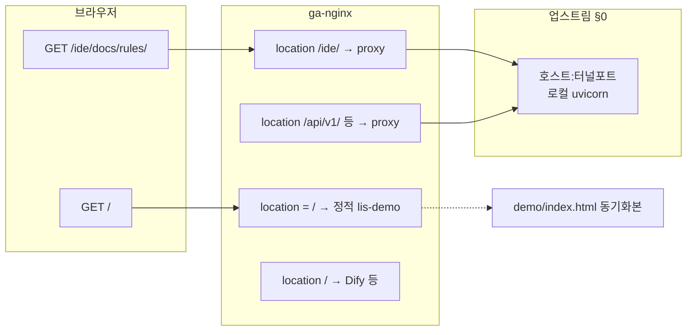

# 현재 작업 세션 — Session 18

> **대상 Phase**: Phase 9 — 강의 데모 UI (강의 전·당일 수동 검증) + 공인 `/ide/docs/rules/`
> **전체 계획 참조**: [`docs/plans/plan.md`](plans/plan.md) §Phase 9
> **워크플로 규칙**: [`docs/rules/workflow_gates.md`](rules/workflow_gates.md)

> **직전 세션**: Session 17 **Gate E 완료**(2026-03-28) — [`docs/history/WORK_HISTORY.md`](history/WORK_HISTORY.md) 「[2026-03-28] Session 17 Gate E — Phase 9 후속·공인 `/ide` 문서·데모 UX·엣지 검증」. Session 17의 pytest **152 passed**·Gate C/D 상세는 Git 이력의 이전 `CURRENT` 커밋을 참고.

---

## 진행 상태

**현재 단계**: **Gate E(부분) 2026-03-28** — `WORK_HISTORY`·`plan.md` 갱신. **Gate D** 결과는 아래 표. **남음**: UI·`DEMO_SCRIPT`·`CURRENT`→Session 19 전면 교체는 강의 후 사용자.

- **완료(에이전트, 2026-03-28 Gate D)**: 사용자 **「다음 단계 진행」** — `make test` → **156 passed**(unit **137** + integration **19**). 공인 `https://lis.qk54r71z.freeddns.org` — **`/health`·`/`·`/ide/docs/rules/`·`/apps` 200**(당시 터널·업스트림 가동 전제). `verify_lis_public_smoke.py`(에이전트 `--base`) **OK**. **`--with-agent` 실패** — `POST /api/v1/agent/query` **502** `DIFY_HTTP_ERROR`·upstream **404 page not found**(공인 뒤 FastAPI의 `DIFY_API_BASE_URL`/워크플로 쪽 — 강의 PC `.env`·`verify_dify_upstream.py --dataset-id …`로 좁힘).
- **완료(에이전트, 2026-03-28 초)**: 사용자 **「진행해라」** = Gate A 승인. `make dev-up`·`make migrate`·`.env.dev`+유효 `ALLOWED_ORIGINS`로 일시 uvicorn → **`GET /ide/docs/rules/`·`/health` 200** (로컬 `127.0.0.1:8765`). 당시 공인 스모크 일부 구간 **502**(터널 미가동 가능).
- **완료(에이전트, 2026-03-27)**: 상세 계획 **Phase C2** `make package-student-rules` → ZIP·SHA256 갱신. **Phase B3·B4** 재실행: `make dev-up` 후 `migrate`(`.env.dev` 사용 시 **`ALLOWED_ORIGINS` 는 JSON 배열**이어야 함 — 파싱 오류 시 쉘에서 `export ALLOWED_ORIGINS='["http://127.0.0.1:8765"]'` 등으로 덮어쓴 뒤 동일) → uvicorn `:8765` → **`/ide/docs/rules/`·`/health`·`/ide/downloads/idr-cursor-rules-student.zip` 전부 200**.
- **완료(에이전트, Gate C/D — 이전 기록)**: `make test` **154 passed** 시점(단위 136 + 통합 18) — 이후 **156 passed** 로 증가(아래 Gate D 표).
- **완료(에이전트, 자체 검증 — 사용자 「다음 단계…사용자쪽도 자체 검증」)**: 아래 「에이전트 자체 검증」절 표 참조 — `scripts/verify_demo_user_journey_local.py` 신설·실행, 공인·Dify·정적 데모 `curl` 스모크.
- **남음(사람 손)**: Dify Studio **E1~E3**·**F1** 육안, 보충 **B3**(터널 중지 재현)·**D2·D3**, 데모 **C-1.4~**·차트, 강의 후 `DEMO_SCRIPT.md`·**Gate E**. 공인 `/ide` **200**은 터널 가동 시 에이전트 재확인됨(환경 따라 다름).

---

## 환경·전제

| 항목 | 참조 |
|------|------|
| FastAPI | 호스트 uvicorn `:8000`, `demo/README.md` 절차 |
| Dify | `make dify-up` 등, Studio `:8080`, 워크플로 `idr_crm_bi_tier2` **Publish** |
| 데모 UI | `demo/index.html` + Live Server(또는 동일 출처), `ALLOWED_ORIGINS`·`INTERNAL_BYPASS_*` |
| ARQ | SCM `forecast`·CRM `cluster` 시연 시 워커·Redis 동일 설정 필요 (`DEMO_SCRIPT.md` 주의) |
| 샘플 데이터 | **`demo/sample_data/`** (`scm_sample.csv`·`crm_sample.csv`·`bi_sample.csv`, `DEMO_SAMPLES_PLAN.md`) — `plan.md` §P9-1 부록 C와 병행 가능 |

---

## 세션 워크플로 상태 (Session 18)

| 게이트 | 완료 | 비고 |
|--------|:----:|------|
| A. 구현 상세 계획 | ✅ | 사용자 **「진행해라」**(2026-03-28) |
| B. 구현 완료 | ✅ | **코드 변경 없음** — 로컬 스모크·공인 `curl`만(§Gate B) |
| C. 테스트 상세 계획 | ✅ | 사용자 **「다음 단계 진행」** — `make test`(15433·`migrate-test`·unit+integration) · **보충 2026-03-28** 사용자 **「승인한다」** — 아래 「ga-server 정적 → 로컬 정적」가설 기반 Phase A~F |
| D. 테스트 검증 | ✅ | **2026-03-28**: `make test` **156 passed**; 공인 B1·B2·`/ide` **200** + `verify_lis_public_smoke` OK; `--with-agent` **502**(`DIFY_*`·Dify 404) 기록. **미기록**: UI·보충 B3·D2·D3·E·F1 직접 수행 |
| E. 이력 이전·문서 전환 | ✅ | **2026-03-28(부분)**: `WORK_HISTORY`·`plan.md` 동기화. **`CURRENT` Session 19 전면 교체**·Phase 9 최종 체크는 강의·`DEMO_SCRIPT`·UI 확정 후 사용자 |

---

## 세션 핸드오프 요약

| 구간 | 한 줄 |
|------|--------|
| **Session 17에서 끝난 것** | `make test` **152 passed**·데모 `/ide` 링크·교육용 HTML 문구·`error_analysis`/remote-proxy·`CURRENT` 내 `/ide` 상세·ga-nginx 마운트 정합(재시작)·`plan.md`/`WORK_HISTORY` 갱신 |
| **Session 18 초점** | **P9-1** 브라우저 리허설(C-1.2~) + 공인 **`/ide/docs/rules/`** HTML 200(§0 터널 또는 담당 배포) |

**바로 다음 액션**: 에이전트 스모크는 아래 표까지 완료. **남음**: 강의 PC에서 Dify Studio UI·데모 전 구간 브라우저·SSH 터널(§0)·필요 시 정적 `scp`·이미지 재빌드 — MCP는 **ga-nginx conf** 만.

---

## 에이전트 자체 검증 (T1·T2·T3 — 사용자 동선의 기계적 대체)

**일시**: 2026-03-28 · 사용자 요청 「사용자쪽도 자체 검증」에 따라 **에이전트 환경에서 실행 가능한 범위**만 수행. 실제 브라우저 조작·터널 개설·Dify 로그인은 포함하지 않음.

| 트랙 | 계획 항목 | 자체 검증 내용 | 결과 |
|------|-----------|----------------|------|
| **T1** | Dify Studio·Publish·Bearer | 호스트 `http://127.0.0.1:8080` 에 대한 `curl -sI`(Dify 프론트 nginx) | **307** → `/apps` (스택 응답 확인). **미검증**: 로그인·워크플로 Publish·HTTP 노드 Bearer·LLM 1회 |
| **T2** | `demo/index.html` C-1.2~ | (1) `demo/` 를 `python3 -m http.server` 로 잠시 서빙 → `GET /index.html` **200** (2) `scripts/verify_demo_user_journey_local.py`: `admin`/`LiveDemo2026!` 로그인 → `scm_sample.csv` 업로드 → 프로필 → `GET /ide/docs/rules/` **200** | **통과** (`APP_ENV=development` 시 dev DB `admin` 비밀번호를 데모 문자열로 동기화 — [`demo/README.md`](../demo/README.md) 참고) |
| **T3** | 공인 `/ide/docs/rules/` 200 | 이 환경에서 `curl -sI https://lis.qk54r71z.freeddns.org/` 및 `/ide/docs/rules/`·`/health` | **`/` 200** · **`/ide`·`/health` 502** — 문서화된 대로 호스트 **8000** 미리슨(터널 없음). 터널 가동 시에만 E1 충족 |

**산출물**: `scripts/verify_demo_user_journey_local.py` (리포 루트·`PYTHONPATH=idr_analytics` 로 실행).

---

## 공인 `lis.*` — `/ide/docs/rules/` 교육생 AI 세팅 가이드 노출 (상세 계획)

> **기록 위치 (필독·반복 위반 방지)**: Gate A·세션 작업의 **구현·실행 상세 계획**(순서·체크리스트·DoD·역할 분담)은 **`docs/CURRENT_WORK_SESSION.md` 본 절(및 아래 Gate A 절)만** 정본이다. **`docs/plans/` 아래에 세션 전용 상세 계획 마크다운을 신설하지 않는다** — `docs/plans/`에는 `plan.md`·[`lis_public_url_path_map.md`](plans/lis_public_url_path_map.md)·강의 보조 등 **WBS·경로·참조** 문서만 둔다. ([`workflow_gates.md`](rules/workflow_gates.md) Gate A·AI 금지, `SKILL.md` 「상세 계획 문서 위치」.)  
> **본 절과 Phase 9**: 병행 과제다. **코드·엣지 변경을 시작하려면** 사용자 **Gate A 승인** 후 진행(MCP는 ga-nginx conf 범위만).

### 진행 기록 (리포)

| 일자 | 항목 | 내용 |
|------|------|------|
| 2026-03-27 | **C2·B3·B4** | `make package-student-rules` 실행 OK. 로컬 uvicorn `:8765`에서 `/ide/docs/rules/`·`/health`·`/ide/downloads/idr-cursor-rules-student.zip` **200** (`.env.dev`의 `ALLOWED_ORIGINS` JSON 불일치 시 마이그레이션·기동 전 export 로 덮어쓰기). |
| 2026-03-28 | **자체검증** | `scripts/verify_demo_user_journey_local.py` 추가·실행(T2 API 동선). 공인 `curl`·Dify `:8080` 스모크. |
| 2026-03-28 | **D1** | `demo/index.html`에 동일 호스트 `/ide/docs/rules/` 링크 추가. |
| 2026-03-28 | **C1·문구** | `demo/ide/docs/rules/index.html` ZIP 구역 404 안내를 §0·엣지 우선으로 정정. |
| 2026-03-28 | **A·E (MCP 읽기·엣지)** | 아래 「검증 스냅샷」. `ga-nginx` **재시작**으로 호스트 `go-almond.swagger.conf` 와 컨테이너 `default.conf` **md5 불일치** 해소 후 `nginx -t`·reload. |
| (담당) | **B·§0** | 호스트 `:8000` 터널·로컬 uvicorn 가동 — 없으면 `172.18.0.1:8000` 업스트림은 **502**(정상). |
| (담당) | **이미지** | ga-server `idr-fastapi` 컨테이너의 `/app/app/main.py`에 **`app.mount` 없음**(구 이미지) — 리포 최신으로 **담당자가** `docker-compose … build` 재배포 시 `/ide` 마운트 코드 반영 가능. MCP로 compose 빌드·재기동은 하지 않음. |

### 목표

동일 호스트 `https://lis.qk54r71z.freeddns.org/` 에서 **`/ide/docs/rules/`** 로 교육생용 AI 세팅 가이드(HTML)를 연다. [`lis_public_url_path_map.md`](plans/lis_public_url_path_map.md) §1·§2와 동일 의도.

### 동일 배포·동일 프로젝트 (정본·오해 제거)

**방향**: 이미 공인에 떠 있는 **같은 `lis_cursor` 배포** 안에서, **별도 도메인·별도 제품 레포를 새로 두지 않고** URL 경로만으로 가이드를 연다.

| 오해 | 실제 |
|------|------|
| 가이드를 **또 하나의 서비스·레포**로 만든다 | **아님.** 자산은 **`demo/ide/`**, 서빙은 **기존 FastAPI** `app.mount("/ide", …)` (`idr_analytics/app/main.py`). |
| 루트 데모와 **완전히 다른 스택**을 붙인다 | **아님.** `/api/v1/`·`/health`·`/ide/` 는 **동일 업스트림**(엣지 nginx `proxy_pass` 일치). |
| nginx에 HTML만 수동 복사하면 끝 | **1차 비권장.** 소스는 리포 **`demo/ide`** 에 두고 이미지·볼륨·터널로 맞춰 **재현성**을 유지한다(예외는 팀 합의·문서화). |

**리포에 이미 있는 것(요약)**: `main.py` 의 `/ide` 마운트, `demo/ide/docs/rules/index.html`, `make package-student-rules` → `demo/ide/downloads/*.zip`, `infra/remote-proxy/*`. 아래 Phase **B·C**와 중복되나 **「한 프로젝트 안 구현」** 관점의 정본 문장으로 둔다.

**성공 기준 (동일 프로젝트 관점)**:

1. 브라우저는 **`https://lis…` 단일 호스트**만으로 데모(`/`)와 교육생 가이드(`/ide/…`)에 진입할 수 있다.  
2. 가이드·ZIP의 **편집 원본은 이 리포**(`demo/ide`, 패키지 스크립트)에만 두고, 세션 상세 계획은 **`CURRENT` 본 절**에만 둔다.  
3. 엣지는 **`/ide/` 와 `/api/v1/` 등 동일 UPSTREAM`** 을 유지하고, §0 운영 표준은 [`lis_public_url_path_map.md`](plans/lis_public_url_path_map.md) §0를 따른다.

### 전제·용어

| 항목 | 내용 |
|------|------|
| **의도된 UX** | `/` = 데모, `/apps` 등 = Dify, **`/ide/…`** = FastAPI `StaticFiles`(`demo/ide`). **서브도메인 분리 아님**. |
| **라우팅** | 1차는 **엣지 nginx `location`**. 데모에서 `<a href="/ide/docs/rules/">` 로 이동 가능. |
| **§0** | 공인 FastAPI 트래픽은 **로컬 uvicorn + 터널(또는 동등)**; ga-nginx는 **호스트 게이트웨이 + 약속 포트**로 `proxy_pass`. |
| **MCP** | **ga-nginx 마운트 conf** 읽기·(명시 시) 수정만. **compose·호스트 `lis_cursor` 동기화·`idr-fastapi` 조작으로 404 메우기 금지** — [`project_context.md`](rules/project_context.md). |

### 목표 아키텍처(mermaid)

**불변조건**: (1) `/ide/` 와 `/api/v1/` 등 **동일 UPSTREAM**. (2) `location /ide/` 가 **`location /` 보다 위**. (3) `location /ide/` + `proxy_pass http://UPSTREAM/ide/;` — 상세·오해는 [`lis_public_url_path_map.md`](plans/lis_public_url_path_map.md) §2·§4.

### Phase A — 엣지(ga-nginx) 점검·정리

| # | 작업 | 산출·검증 |
|---|------|-----------|
| A1 | `lis.qk54r71z.freeddns.org` 블록에 `location /ide/` 존재 | grep / 파일 확인 |
| A2 | `location = /ide` → `301 /ide/` (또는 동등) | `/ide` 단독이 Dify로 가지 않음 |
| A3 | `proxy_pass` 가 **`…/ide/`** 로 끝남 | 접두 `/ide` 유지 |
| A4 | `/api/v1/`·`/health`·`/docs`·`/openapi.json`·`/ide/` **동일 UPSTREAM** | 문자열 diff 없음 |
| A5 | §0 시 **127.0.0.1 금지** — `docker exec ga-nginx ip route show default` 의 **via** + 포트 | 172.17/172.18 등 환경별 |
| A6 | 변경 시 `nginx -t` → reload | |

**리포 참고**: `infra/remote-proxy/ga-server-append-lis.qk54r71z.conf.snippet`, `patch_lis_nginx_remote.py`, [`../infra/remote-proxy/README.md`](../infra/remote-proxy/README.md).

### Phase B — 업스트림 FastAPI(§0·강의 PC)

| # | 작업 | 산출·검증 |
|---|------|-----------|
| B1 | `demo/ide/docs/rules/index.html` 존재 | 로컬 |
| B2 | 리포 기준 API 기동 | `.env`·절차는 강의/로컬 문서 |
| B3 | `curl -sf http://127.0.0.1:<포트>/ide/docs/rules/ \| head` | **200** HTML |
| B4 | 로그에 IDE 마운트 경로 확인 | 미마운트 시 404 |
| B5 | SSH `-R` 등으로 **ga-server 호스트**에 터널 포트 | 담당자가 `ss -lntp` 등 확인 |
| B6 | 터널 포트 = nginx `UPSTREAM` | A5와 일치 |

**코드 정본**: `idr_analytics/app/main.py`. 로컬 운영형: [`../infra/deploy/local-prod/README.md`](../infra/deploy/local-prod/README.md). 강의 동선: [`plans/ppt_aux_instructor_build_guide.md`](plans/ppt_aux_instructor_build_guide.md).

### Phase C — 정적 자산(리포)

| # | 작업 | 산출 |
|---|------|------|
| C1 | 가이드 HTML | `demo/ide/docs/rules/index.html` |
| C2 | ZIP | `make package-student-rules` |
| C3 | 문구·URL 정합 | [`plans/student_rules_download_lis_plan.md`](plans/student_rules_download_lis_plan.md) |

### Phase D — 데모 진입 UX(선택)

| # | 작업 | 비고 |
|---|------|------|
| D1 | `demo/index.html` 에 `/ide/docs/rules/` 링크 | ✅ 2026-03-28 — 절대 경로 `/ide/docs/rules/` (동일 호스트) |
| D2 | 루트 정적 배포 | `scp`/담당자 절차 — MCP 호스트 쓰기 아님 |

### Phase E — 공인 스모크·분기

| # | 검사 | 기대 |
|---|------|------|
| E1 | `curl -sI https://lis.qk54r71z.freeddns.org/ide/docs/rules/` | 200, `text/html` |
| E2 | JSON `{"detail":"Not Found"}` | 업스트림 — B3·B4·B6 |
| E3 | 502/504 | 터널·게이트웨이 |
| E4 | Dify 페이지 | A2·A3·순서 |

### 역할·DoD·참고 링크

| 역할 | 할 일 |
|------|--------|
| 엣지 담당 | conf·reload·게이트웨이 실측 기록 |
| 강의 PC | 리포·uvicorn·터널·로컬 curl |
| AI(MCP) | conf 읽기·(요청 시) conf 편집만 |

**DoD**: Phase A 충족(또는 예외 문서화) · B3 로컬 200 · E1 공인 200 · ~~(선택) D1~~ → **D1 리포 반영됨**(2026-03-28).

| 문서 | 용도 |
|------|------|
| [`plans/lis_public_url_path_map.md`](plans/lis_public_url_path_map.md) | 경로·§0 |
| [`plans/student_rules_download_lis_plan.md`](plans/student_rules_download_lis_plan.md) | ZIP·랜딩 |
| [`rules/project_context.md`](rules/project_context.md) / [`rules/error_analysis.md`](rules/error_analysis.md) | MCP·재발 |

**개정**: 2026-03-27 — 본 절 `CURRENT` 통합. 2026-03-27 — `docs/plans/lis_ide_docs_rules_public_rollout_plan.md` 에서 이전.

### 검증 스냅샷 (2026-03-28, ga-server)

| 단계 | 결과 |
|------|------|
| 호스트 vs `ga-nginx` 안 `default.conf` md5 | **불일치**였음 → `docker restart ga-nginx` 후 **일치** (`go-almond.swagger.conf` 마운트 정상화). |
| Phase A | `lis` 블록: `location = /ide` → 301, `/api/v1/`·`/health`·`/docs`·`/openapi`·`/ide/` **동일** `http://172.18.0.1:8000/…` (호스트 파일 기준). |
| Phase E1 | 공인 `GET /ide/docs/rules/` → **502** `text/html`(업스트림 거절 — 호스트 **8000** 미리슨·터널 없음, §0 전제). |
| `idr-fastapi` | `/app/demo/ide/docs/rules/index.html` **존재**하나, 런타임 `main.py`에 **`mount` 없음** → 구 이미지. 리포에는 `app.mount("/ide", …)` 있음. |

### 공인 `/ide/docs/rules/` 502 — 원인 확정 (2026-03-28, MCP 재검증)

| 점검 | 결과 |
|------|------|
| 브라우저/API | `HTTP/1.1 502 Bad Gateway`, `Server: nginx/1.29.4` — **엣지 nginx** 가 업스트림에 붙지 못함. |
| `lis` 블록 `proxy_pass` | FastAPI 경로 전부 **`http://172.18.0.1:8000/…`** (호스트 게이트웨이 = `docker exec ga-nginx ip route` 의 **via 172.18.0.1**). |
| `ga-nginx` → `172.18.0.1:8000` | **`Connection refused`** — 호스트 **8000** 에 **리스너 없음**(SSH `-R` 터널·로컬 uvicorn 바인딩 미가동). → **502 직접 원인**. |
| `ga-nginx` → `http://idr-fastapi:8000/health` | **`{"status":"ok"}`** — 동일 Docker 네트워크의 API 컨테이너는 살아 있음. |
| `ga-nginx` → `idr-fastapi:8000/ide/docs/rules/` | **HTTP 404** — 런타임에 **`/ide` 마운트 없음**(구 이미지). nginx만 `idr-fastapi`로 바꿔도 **502→404** 로 바뀔 뿐 가이드 HTML은 안 뜸. |

**의도 정합**: «이미 `https://lis…/` 에 구축된 환경에서 **라우트**로 `/ide/docs/rules/` 연다»는 [`lis_public_url_path_map.md`](plans/lis_public_url_path_map.md) **§1·§1.1** 과 동일하다. 502는 라우팅 설계 오류가 아니라 **업스트림 소켓이 비어 있음**이다.

**조치(§0 표준·패턴 B)**: 강의 PC uvicorn + **SSH `-R`** 로 ga-server 호스트 `:8000` 에 붙임 → nginx가 가리키는 게이트웨이 `:8000` 이 살아난다.

**조치(배포 일체형·패턴 A)**: 이미 스택에 **`idr-fastapi`** 가 있다면 nginx FastAPI `proxy_pass` 를 **`http://idr-fastapi:8000`** 으로 통일하고, 컨테이너는 리포 기준 **이미지 재빌드**로 `app.mount("/ide", …)`·`demo/ide` 볼륨 반영 — **담당자** `docker-compose … build/up`(MCP로 compose 조작은 하지 않음).

---

## 완료 기준 (Session 18)

- [ ] `demo/DEMO_SCRIPT.md` 리허설 체크리스트 전항 확인(가능한 범위)
- [ ] `plan.md` §P9-1 — Dify Publish·Bearer·샘플·LLM 1회 — 브라우저/Studio에서 사용자 확인
- [ ] `demo/index.html` 강의 동선 최소 1회 브라우저 통과(C-1.2~)
- [ ] 공인 `https://lis…/ide/docs/rules/` **200 HTML** — 위 「공인 `/ide`」절 Phase **B·E** 또는 담당자 예외 배포
- [ ] (강의 후) Phase 9 완료 표·`WORK_HISTORY`·`plan.md` — Session 18 **Gate E**

---

## 구현 상세 계획 (Gate A) — Session 18

### 1. 목적·범위·완료 정의

| 구분 | 내용 |
|------|------|
| **목적** | (1) **강의 당일 시연**이 `plan.md` §P9-1·§Phase 9 완료 기준을 만족하는지 **브라우저·Studio에서 검증**. (2) 교육생 안내 URL **`/ide/docs/rules/`** 가 공인에서 **HTML 200**으로 열리게 한다(§0 터널이 표준, 예외는 문서화). |
| **산출물** | Gate **D**에 일시·통과·스킵 사유·스크린샷 경로(선택) 기록. 공인 `/ide`는 `curl -sI` 결과 또는 브라우저 캡처 1장. |
| **코드 변경** | **원칙 없음**. CORS·데모 HTML 오타·강의 중만 필요한 **최소 수정**만 사용자 지시 시. |
| **Session 18 완료(Gate E)** | 상단 「완료 기준」 체크 가능한 항목을 채우고, `WORK_HISTORY`·`plan.md` 세션 표·Phase 9 표를 동기화. |

**트랙 구분(병행 가능하나 순서 권장)**:

| 트랙 | 코드 | 내용 |
|------|------|------|
| **T1** | P9-1 | Dify·FastAPI·Bearer·(선택) 사전 업로드 |
| **T2** | DEMO | `demo/index.html` 브라우저 시나리오 C-1.2~ |
| **T3** | `/ide` | 공인 규칙 가이드 — 위 「공인 `lis.*`」절 Phase **B→E** |
| **T4** | DOC | `DEMO_SCRIPT.md` 체크·강의 후 이력 |

권장 순서: **T1 → T2** (같은 PC에서 API+Dify+데모 탭) → **T3** (터널·엣지는 별도 담당 가능) → 강의 후 **T4**.

---

### 2. T1 — P9-1 환경 점검 (강의 PC·Studio)

**정본**: [`plans/plan.md`](plans/plan.md) §**P9-1**, [`demo/DEMO_SCRIPT.md`](../demo/DEMO_SCRIPT.md) 상단 체크리스트.

| # | 작업 | 구체적 행동 | 기대 |
|---|------|-------------|------|
| T1.1 | Dify 기동 | `make dify-up` 등 기존 절차, `:8080` 로그인 | Studio 접속 |
| T1.2 | 워크플로 Publish | `idr_crm_bi_tier2`(또는 강의 확정 ID) **Publish** 상태 | 초안만 있으면 HTTP 노드 실패 |
| T1.3 | FastAPI 헬스 | `make dev-up`·`make migrate` 후 `uvicorn`(또는 로컬 운영형), `curl -sf http://127.0.0.1:8000/health` | 200 `ok` |
| T1.4 | Bearer | `make dify-fastapi-jwt-bearer` 또는 문서 절차로 토큰 갱신 → Dify HTTP Request 노드·환경변수 반영 | 401 없이 노드 호출 |
| T1.5 | (선택) Tier2 스모크 | Studio 또는 데모 「Dify AI 요약」에서 LLM 응답 1회 | 텍스트 응답 |
| T1.6 | (선택) 샘플 사전 업로드 | `demo/sample_data/*.csv` 를 강의 전에 업로드해 `dataset_id` 확보 | 강의 중 대기 시간 감소 |

**실패 시**: `DEMO_SCRIPT.md` 「문제 발생 시 짧은 우회」·`plan.md` 부록 참고. Gate D에 **어느 단계에서 막혔는지** 한 줄 기록.

---

### 3. T2 — 브라우저 데모 (`demo/index.html`, 개발 DB 15432)

**전제**: `.env`의 `DATABASE_URL`→`localhost:15432`, `REDIS_URL`→`6379`, CORS에 공인·로컬 출처, `admin` 시드는 [`demo/README.md`](../demo/README.md).

**단일 원본 시나리오**: [`demo/sample_data/SAMPLE_DATA_TEST_PLAN.md`](../demo/sample_data/SAMPLE_DATA_TEST_PLAN.md), 보조 체크 [`DEMO_SAMPLES_PLAN.md`](../demo/sample_data/DEMO_SAMPLES_PLAN.md) §5.

| # | 절차 | 기대 |
|---|------|------|
| C-1.2 | 데모 페이지에서 JWT 로그인 또는 우회 Bearer 설정 | 이후 API 401 아님 |
| C-1.3 | `scm_sample.csv` 업로드, `dataset_type=scm` | `dataset_id`·프로필 |
| C-1.4 | SCM — 예측 실행 → 폴링 | 워커 기동 시 `completed`·차트(미기동 시 `pending` — 리허설에서 ARQ 여부 명시) |
| C-1.5~1.7 | CRM 업로드·이탈·클러스터 | 표/차트 또는 폴링 정책 동일 |
| C-1.8~1.10 | BI 업로드·히트맵·YoY | `period` 문자열 CSV와 일치 |
| C-1.11 | (선택) Dify 앱에서 동일 `dataset_id` | Tier2 연결 확인 |

**강의 동선 리허설**: `DEMO_SCRIPT.md` 본문 1~4단계 — 오전(규칙·Gate)·오후(데모 탭·Dify)·시간 배분 [`ref_files/컨설팅계획서_김희원_IDR시스템즈_전문가_양식.md`](../ref_files/컨설팅계획서_김희원_IDR시스템즈_전문가_양식.md) 참고.

**데모에서 `/ide` 링크**: 제목 아래 링크로 동일 호스트 `/ide/docs/rules/` 이동 확인(공인에서만 의미 있음; 로컬 단독 파일 열기 시 API 베이스는 별도).

---

### 4. T3 — 공인 `/ide/docs/rules/` (§0 표준 + 분기)

**정본 표**: 본 문서 위 절 **Phase A~E** 및 [`plans/lis_public_url_path_map.md`](plans/lis_public_url_path_map.md).

#### 4.1 표준 경로(팀 §0)

1. **로컬**: 리포에서 uvicorn, `curl -sf http://127.0.0.1:<포트>/ide/docs/rules/| head` → **200 HTML**.  
2. **터널**: SSH `-R 0.0.0.0:8000:127.0.0.1:<포트> user@ga-server` (또는 팀 표준) — ga-server **호스트** `:8000` 리슨.  
3. **엣지**: `ga-nginx`의 `lis` 블록이 **게이트웨이 IP:8000** 으로 통일되어 있는지(`ip route show default` 실측).  
4. **검증**: `curl -sI https://lis.qk54r71z.freeddns.org/ide/docs/rules/` → `200`, `text/html`.

**conf 편집 후**: 호스트 파일과 `docker exec ga-nginx md5sum /etc/nginx/conf.d/default.conf` **일치** 확인 → 불일치 시 `docker restart ga-nginx` 후 재확인([`error_analysis.md`](rules/error_analysis.md) 2026-03-28 항목).

#### 4.2 증상 분기 (공인)

| 응답 | 의미 | 다음 조치 |
|------|------|-----------|
| **502** HTML | nginx는 살아 있으나 업스트림 거절 | 호스트 `:8000` 터널·uvicorn 가동(T3 §4.1 2~3) |
| **404** `application/json` | FastAPI `detail` | 업스트림에서 `/ide` 미마운트·`demo/ide` 없음 — 로컬에서 B3 재현 후 이미지/경로 점검 |
| **Dify UI** | `location /` 이 `/ide` 보다 우선 | 엣지에서 `location /ide/` 위로 이동·`location = /ide` 301 |

#### 4.3 예외(패턴 A, 별도 합의 시만)

ga-server `idr-fastapi:8000` 으로 nginx를 통일하고 컨테이너가 `/ide` 를 서빙하게 하려면 **리포 기준 이미지 재빌드**(`app.mount` 포함)·담당자 배포가 필요. **AI MCP로 compose 빌드·재기동하지 않음.**

---

### 5. T4 — 문서·마감 (Gate E)

| # | 작업 |
|---|------|
| E1 | `DEMO_SCRIPT.md` 체크리스트 — 수행한 항목만 `- [x]` |
| E2 | `docs/history/WORK_HISTORY.md` — Session 18 요약 항목 추가 |
| E3 | `plans/plan.md` — 세션 표 Session 18 완료일·Phase 9 완료 기준 표와 동기화 |
| E4 | 본 `CURRENT` — Session 19용으로 교체하거나 강의 전 **최소 핸드오프**만 남김 |

---

### 6. Gate B / C / D (Session 18 해석)

| 게이트 | Session 18에서의 의미 |
|--------|------------------------|
| **B** | T1~T3 수행 중 **코드·설정을 건드렸다면** 변경 파일·사유 요약. **안 건드렸으면** 「코드 변경 없음, 수동 검증만」. |
| **C** | (선택) `make test` 재실행을 넣을지 — 넣는다면 명령·전제(15433 스택)를 본 절에 **사용자 승인 후** 추가. **기본값**: Session 17에서 152 passed 이미 있으므로 **생략 가능**. |
| **D** | T1~T3·T4 실행 일시·결과표(위 표 ID와 매칭). 브라우저 단계는 **사용자 기록** 필수. |

---

### 7. 리스크·금지 (재확인)

- **Gate A 문구만으로 구현 시작하지 않음** — 사용자 **명시 승인**(예: 「진행해라」) 후 T1~T3 실행.  
- **`make test`**: 사용자가 테스트까지 허용했다고 **명시**한 경우에만(SKILL **Gate B 직후 멈춤**).  
- **MCP**: `ga-nginx` **conf 읽기·(요청 시) conf 수정**만. **compose·호스트 `lis_cursor`·`idr-fastapi` 조작**으로 `/ide`를 메우지 않음 — [`project_context.md`](rules/project_context.md).  
- **비밀**: Bearer·`.env` 는 Git·채팅 로그에 남기지 않음.

**개정**: 2026-03-28 — Session 18 Gate A 상세안 초안.

---

## 구현 완료 요약 (Gate B)

| 구분 | 내용 |
|------|------|
| **코드·리포** | Gate B 당시 **변경 없음**. **Gate C/D**: `idr_analytics/tests/integration/test_api_sample_data_upload.py` — `row_count` 를 `_csv_data_row_count()` 로 검증. **자체 검증**: `scripts/verify_demo_user_journey_local.py` 신설. |
| **인프라(로컬)** | `make dev-up` — `idr-postgres`·`idr-redis` 기동. `make migrate` — Alembic head. |
| **런타임 스모크** | `idr_analytics`에서 `.env.dev` 로드 + `ALLOWED_ORIGINS` JSON 배열 export 후 `uvicorn app.main:app --port 8765` 일시 기동 → `GET /ide/docs/rules/` **200**, `GET /health` **200**. 이후 프로세스 종료. |
| **공인(MCP·읽기)** | `https://lis.qk54r71z.freeddns.org/ide/docs/rules/`·`/health` → **502** — nginx 업스트림 `172.18.0.1:8000` 거절(터널·호스트 리슨 없음). |

---

## 테스트 계획 (Gate C) — Session 18

| 항목 | 내용 |
|------|------|
| **승인** | 사용자 **「다음 단계 진행」**(Gate B 이후 테스트 단계로 해석). |
| **명령** | 리포 루트 `make test` — `test-infra-up` → `migrate-test` → `pytest idr_analytics/tests/unit/` → `pytest idr_analytics/tests/integration/` → `test-infra-down`. |
| **전제** | `.env.test` 또는 Makefile 기본 `POSTGRES_PASSWORD`·`SECRET_KEY` 등(비밀 미기록). |
| **완료 정의** | exit 0, 통합·단위 전부 통과. |

### 보충 — ga-server 정적 → 로컬 정적(FastAPI·터널) 가설 기반 통합 검증

**승인**: 사용자 **「승인한다」**(2026-03-28) — 본 보충을 Gate C 테스트 계획 정본에 포함.

**가설**: 과거 **ga-server 쪽에 정적 웹**을 두던 구성에서는 호스트·경로가 상대적으로 한 덩어리로 묶여 문제가 덜 드러났고, **리포 기준 로컬 정적(`demo/` + FastAPI `StaticFiles`) + §0 터널**로 바뀌면서 **업스트림이 세 갈래**로 분리된다 — (1) 브라우저 → 공인 `lis` → **FastAPI**, (2) **FastAPI → Dify** API(`DIFY_API_BASE_URL`), (3) **Dify 워크플로 HTTP 노드 → FastAPI**. 각 구간이 독립적으로 맞아야 하며, 예전 단일 서버같이 **우연히 맞춰지지 않으면** 502·404·401·`workflows/run` 실패 등이 표면화된다.

**정본·도구**: [`plans/lis_public_url_path_map.md`](plans/lis_public_url_path_map.md) §0·§2, [`infra/dify/workflows/README.md`](../infra/dify/workflows/README.md), [`scripts/verify_dify_upstream.py`](../scripts/verify_dify_upstream.py), [`scripts/verify_lis_public_smoke.py`](../scripts/verify_lis_public_smoke.py).

#### Phase A — 아키텍처 동등성

| ID | 점검 | 통과 기준 |
|----|------|-----------|
| **A1** | `lis_public_url_path_map.md` §0·§2와 실제 엣지 `proxy_pass`를 표로 대조 | `GET /`·`/api/v1/`·`/ide/` 가 **동일 업스트림**(패턴 B)인지 문서화 |
| **A2** | 데모 페이지 **API 베이스 URL** | 공인 **단일 오리진**(`https://lis…`)과 일치 — 타 포트·호스트 시 HTML 응답·CORS 가능 ([`demo/index.html`](../demo/index.html) 주석과 동일 취지) |

#### Phase B — 엣지 → FastAPI (과거 대비 502 구간)

| ID | 점검 | 통과 기준 |
|----|------|-----------|
| **B1** | `GET https://lis…/health` | 200, JSON `status=ok` |
| **B2** | `GET https://lis…/` | 데모 HTML(제목·탭) |
| **B3** | SSH 터널·uvicorn **의도적 중지** 후 B1 재시도 | **502 재현** 가능하면 원인 후보 확정(업스트림 없음) |

#### Phase C — 브라우저 → FastAPI (JWT·동적 dataset)

| ID | 점검 | 통과 기준 |
|----|------|-----------|
| **C1** | `POST …/auth/login` | 200 + `access_token` (비밀번호는 [`demo/README.md`](../demo/README.md) 정본) |
| **C2** | `GET …/api/v1/datasets` + Bearer | 200 |
| **C3** | 데모에서 샘플 업로드 후 표시 **`dataset_id`** | C2 목록의 id와 일치 |

#### Phase D — FastAPI → Dify (`DIFY_*`, uvicorn 호스트)

| ID | 점검 | 통과 기준 |
|----|------|-----------|
| **D1** | **uvicorn이 도는 PC**에서 `make verify-dify-upstream` | `POST …/workflows/run` **HTTP 코드·본문** 기록 |
| **D2** | `mixed_from_lis.csv` 등 **CRM+BI 동시 만족** 데이터셋 업로드 후 `poetry run python scripts/verify_dify_upstream.py --dataset-id <UUID> --period <CSV 내 실제 period>` | 워크플로 `data.status` **succeeded** 또는 Studio **Trace**로 실패 노드·URL 확정 |
| **D3** | `DIFY_API_BASE_URL` 를 의도적으로 틀린 값으로 설정 후 D1 | 실패(404/연결 거부) **재현** 후 `.env` 복구·uvicorn 재시작 |

#### Phase E — Dify 워크플로 → FastAPI (Studio)

| ID | 점검 | 통과 기준 |
|----|------|-----------|
| **E1** | HTTP Request 노드 **URL 호스트** | Dify 런타임(Podman/Docker)에서 FastAPI에 닿는 주소(`host.containers.internal:8000` 등) |
| **E2** | `Authorization: Bearer` | 유효 JWT — 만료 시 `make dify-fastapi-jwt-bearer` 등으로 갱신 |
| **E3** | 노드와 **동일 URL**을 호스트에서 `curl` + Bearer | FastAPI **200**(노드와 동일 조건) |

#### Phase F — 종단(실사용)

| ID | 점검 | 통과 기준 |
|----|------|-----------|
| **F1** | 데모 탭 **「Dify AI 요약」→ 에이전트 실행** | Tier2 응답 또는 JSON `detail`로 다음 조치 특정(502 시 `DIFY_*` 힌트 등) |
| **F2** | (선택) `python3 scripts/verify_lis_public_smoke.py --base https://lis… --with-agent` | Tier2 전제(Dify·DB·JWT) 명시 |

#### 증상 → 구간 매핑 (이번 세션에서 관측된 패턴)

| 관측 | 우선 점검 Phase |
|------|-----------------|
| 공인 API **502** | **B** |
| `/apps` OK, API만 이상 | **B** + **A2** |
| `workflows/run` **404** | **D1·D3** |
| `workflows/run` 200·워크플로 **failed**·HTTP **404** | **D2**(period·dataset·mixed CSV), **E** |
| Dify 노드 **401** | **E2** |

**산출물 (DoD)**: Phase별 **통과/실패** 한 줄·HTTP 코드·(가능 시) curl 발췌; 실패 시 **A~F** 중 어느 구간인지 라벨. Gate D 표에 행 추가.

---

## 테스트 검증 결과 (Gate D) — 에이전트 구간만

**일시**: 2026-03-28 · **추가 2026-03-27**(상세 계획 재실행) · **추가 Gate C/D**(동일일 `make test`) · **갱신 2026-03-28**(사용자 「다음 단계 진행」— 보충 계획 실행)

| 트랙 | 항목 | 결과 |
|------|------|------|
| pytest | `make test` | **156 passed**(unit **137** + integration **19**), **0 failed** — 2026-03-28 |
| **보충 B1** | `GET https://lis…/health` | **200** `{"status":"ok"}` (2026-03-28) |
| **보충 B2** | `GET https://lis…/` | **200** — 제목 `IDR Analytics — 강의 데모` |
| **보충** | `GET https://lis…/ide/docs/rules/` | **200** (2026-03-28, 터널·업스트림 가동 시; 미가동 시 **502** — 아래 T3(공인 E1) 참고) |
| **보충 F2** | `verify_lis_public_smoke.py --base https://lis…` | **OK** (2026-03-28) |
| **보충 F2** | 동일 스크립트 **`--with-agent`** | **실패** — `POST …/agent/query` **502** `DIFY_HTTP_ERROR`·upstream **404 page not found** (FastAPI→Dify; 터널 끝 `.env` `DIFY_*`) |
| **보충 A1** | nginx·문서 대조 | 에이전트 미실행 — [`lis_public_url_path_map.md`](plans/lis_public_url_path_map.md)·[`ga-server-append-lis` 스니펫](../infra/remote-proxy/ga-server-append-lis.qk54r71z.conf.snippet) |
| **보충 A2** | 데모 API 베이스 | 동일 호스트 권장 — [`demo/index.html`](../demo/index.html) 주석 |
| (과거) pytest | `make test` | **154 passed**(unit 136 + integration 18) — 이전 기록 |
| T3(로컬 B3) | `curl` `/ide/docs/rules/` (uvicorn 8765) | **200** HTML |
| T3(로컬) | `curl` `/health` | **200** |
| T3(로컬·C2) | `make package-student-rules` 후 `curl` `/ide/downloads/idr-cursor-rules-student.zip` (8765) | **200** (2026-03-27) |
| T3(공인 E1) | `curl` 공인 `/ide/docs/rules/` | **502** — 원인: **`172.18.0.1:8000` connection refused**(호스트 8000 미리슨). §공인 `/ide` 502 표 참조. |
| T3(교차) | `ga-nginx`→`idr-fastapi:8000/health` | **200** `ok` |
| T3(교차) | `ga-nginx`→`idr-fastapi:8000/ide/docs/rules/` | **404**(구 이미지·`/ide` 미마운트) |
| T1(스모크) | `curl -sI http://127.0.0.1:8080/` | **307** `/apps` (2026-03-28 에이전트) |
| T2(API) | [`scripts/verify_demo_user_journey_local.py`](../scripts/verify_demo_user_journey_local.py) | **OK** 로그인·SCM 업로드·프로필·`/ide/docs/rules/` (동일일) |
| T2(정적) | `http.server` + `GET /index.html` | **200** (동일일) |
| T3(공인) | `curl` `https://lis…/` · `/ide/docs/rules/` | **이전**: `/` 200 · `/ide` **502**(터널 없음). **2026-03-28 재측정**: 둘 다 **200**(터널 가동 시) |
| T1·T2(UI) | Dify Studio 로그인·데모 전 탭·차트 육안 | **미실시** — 강의 PC 사용자 |
| 보충 **C~E·B3·D2·D3** | 브라우저·Studio·의도적 장애 주입 | **미실시** — 사용자 |

**다음**: 보충 Phase **E·F1·B3·D2·D3**·육안 검증 후 본 표에 행 추가. **Gate E(이력)**: [`WORK_HISTORY.md`](history/WORK_HISTORY.md) 「Session 18 — Gate D…」·`plan.md` Session 18 행 갱신됨(2026-03-28).

---

## Session 17 보관 참조

Session 17의 **Gate B·C·D 전문**(데모 샘플·`test_api_sample_data_upload.py`·당시 **152 passed**·C-1.1 스모크 등)은 Git 이력에서 본 파일의 **이전 커밋** 또는 `WORK_HISTORY` 「Session 17 Gate E」항목과 함께 조회한다. (Session 18 Gate D 갱신 기준 pytest **156 passed**.)

---

## 이전 세션 요약 (Session 16)

데모 UI 3종 + `env.example` 보강, 전체 pytest 회귀 통과. 상세는 [`docs/history/WORK_HISTORY.md`](history/WORK_HISTORY.md) 동일 제목 항목.
