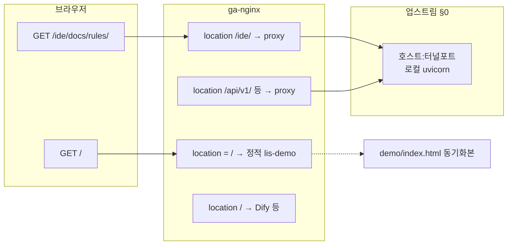

# 현재 작업 세션 — Session 18

> **대상 Phase**: Phase 9 — 강의 데모 UI (강의 전·당일 수동 검증) + 공인 `/ide/docs/rules/`
> **전체 계획 참조**: [`docs/plans/plan.md`](plans/plan.md) §Phase 9
> **워크플로 규칙**: [`docs/rules/workflow_gates.md`](rules/workflow_gates.md)

> **직전 세션**: Session 17 **Gate E 완료**(2026-03-28) — [`docs/history/WORK_HISTORY.md`](history/WORK_HISTORY.md) 「[2026-03-28] Session 17 Gate E — Phase 9 후속·공인 `/ide` 문서·데모 UX·엣지 검증」. Session 17의 pytest **152 passed**·Gate C/D 상세는 Git 이력의 이전 `CURRENT` 커밋을 참고.

---

## 진행 상태

**현재 단계**: **Session 18 착수 — Gate A 승인 대기**

- **남음**: `plan.md` §P9-1 브라우저(C-1.2~)·`demo/DEMO_SCRIPT.md` 리허설·공인 `/ide` Phase **B·E**(터널 또는 담당자 예외 배포)·강의 후 Phase 9 완료 표 확정.
- 아래 **「구현 상세 계획 (Gate A)」** 승인 후 구현·수동 검증을 진행한다.

---

## 환경·전제

| 항목 | 참조 |
|------|------|
| FastAPI | 호스트 uvicorn `:8000`, `demo/README.md` 절차 |
| Dify | `make dify-up` 등, Studio `:8080`, 워크플로 `idr_crm_bi_tier2` **Publish** |
| 데모 UI | `demo/index.html` + Live Server(또는 동일 출처), `ALLOWED_ORIGINS`·`INTERNAL_BYPASS_*` |
| ARQ | SCM `forecast`·CRM `cluster` 시연 시 워커·Redis 동일 설정 필요 (`DEMO_SCRIPT.md` 주의) |
| 샘플 데이터 | **`demo/sample_data/`** (`scm_sample.csv`·`crm_sample.csv`·`bi_sample.csv`, `DEMO_SAMPLES_PLAN.md`) — `plan.md` §P9-1 부록 C와 병행 가능 |

---

## 세션 워크플로 상태 (Session 18)

| 게이트 | 완료 | 비고 |
|--------|:----:|------|
| A. 구현 상세 계획 | ⬜ | 사용자 승인 후에만 코드·엣지 착수 |
| B. 구현 완료 | ⬜ | |
| C. 테스트 상세 계획 | ⬜ | |
| D. 테스트 검증 | ⬜ | |
| E. 이력 이전·문서 전환 | ⬜ | Session 18 마감 시 |

---

## 세션 핸드오프 요약

| 구간 | 한 줄 |
|------|--------|
| **Session 17에서 끝난 것** | `make test` **152 passed**·데모 `/ide` 링크·교육용 HTML 문구·`error_analysis`/remote-proxy·`CURRENT` 내 `/ide` 상세·ga-nginx 마운트 정합(재시작)·`plan.md`/`WORK_HISTORY` 갱신 |
| **Session 18 초점** | **P9-1** 브라우저 리허설(C-1.2~) + 공인 **`/ide/docs/rules/`** HTML 200(§0 터널 또는 담당 배포) |

**바로 다음 액션**: Gate A에 대해 사용자 **「진행해라」** 등 승인 → 브라우저·터널·(필요 시) 정적 `scp`·이미지 재빌드는 **담당자·강의 PC**; MCP는 **ga-nginx conf** 만.

---

## 공인 `lis.*` — `/ide/docs/rules/` 교육생 AI 세팅 가이드 노출 (상세 계획)

> **기록 위치**: 워크플로 규칙에 따라 **작업 상세·실행 순서는 `docs/CURRENT_WORK_SESSION.md`에만** 둔다 ([`workflow_gates.md`](rules/workflow_gates.md) 표준 섹션·`SKILL.md` 참고). 경로 의미·§0 정본은 [`plans/lis_public_url_path_map.md`](plans/lis_public_url_path_map.md).  
> **본 절과 Phase 9**: 병행 과제다. **코드·엣지 변경을 시작하려면** 사용자 **Gate A 승인** 후 진행(MCP는 ga-nginx conf 범위만).

### 진행 기록 (리포)

| 일자 | 항목 | 내용 |
|------|------|------|
| 2026-03-28 | **D1** | `demo/index.html`에 동일 호스트 `/ide/docs/rules/` 링크 추가. |
| 2026-03-28 | **C1·문구** | `demo/ide/docs/rules/index.html` ZIP 구역 404 안내를 §0·엣지 우선으로 정정. |
| 2026-03-28 | **A·E (MCP 읽기·엣지)** | 아래 「검증 스냅샷」. `ga-nginx` **재시작**으로 호스트 `go-almond.swagger.conf` 와 컨테이너 `default.conf` **md5 불일치** 해소 후 `nginx -t`·reload. |
| (담당) | **B·§0** | 호스트 `:8000` 터널·로컬 uvicorn 가동 — 없으면 `172.18.0.1:8000` 업스트림은 **502**(정상). |
| (담당) | **이미지** | ga-server `idr-fastapi` 컨테이너의 `/app/app/main.py`에 **`app.mount` 없음**(구 이미지) — 리포 최신으로 **담당자가** `docker-compose … build` 재배포 시 `/ide` 마운트 코드 반영 가능. MCP로 compose 빌드·재기동은 하지 않음. |

### 목표

동일 호스트 `https://lis.qk54r71z.freeddns.org/` 에서 **`/ide/docs/rules/`** 로 교육생용 AI 세팅 가이드(HTML)를 연다. [`lis_public_url_path_map.md`](plans/lis_public_url_path_map.md) §1·§2와 동일 의도.

### 전제·용어

| 항목 | 내용 |
|------|------|
| **의도된 UX** | `/` = 데모, `/apps` 등 = Dify, **`/ide/…`** = FastAPI `StaticFiles`(`demo/ide`). **서브도메인 분리 아님**. |
| **라우팅** | 1차는 **엣지 nginx `location`**. 데모에서 `<a href="/ide/docs/rules/">` 로 이동 가능. |
| **§0** | 공인 FastAPI 트래픽은 **로컬 uvicorn + 터널(또는 동등)**; ga-nginx는 **호스트 게이트웨이 + 약속 포트**로 `proxy_pass`. |
| **MCP** | **ga-nginx 마운트 conf** 읽기·(명시 시) 수정만. **compose·호스트 `lis_cursor` 동기화·`idr-fastapi` 조작으로 404 메우기 금지** — [`project_context.md`](rules/project_context.md). |

### 목표 아키텍처(mermaid)

**불변조건**: (1) `/ide/` 와 `/api/v1/` 등 **동일 UPSTREAM**. (2) `location /ide/` 가 **`location /` 보다 위**. (3) `location /ide/` + `proxy_pass http://UPSTREAM/ide/;` — 상세·오해는 [`lis_public_url_path_map.md`](plans/lis_public_url_path_map.md) §2·§4.

### Phase A — 엣지(ga-nginx) 점검·정리

| # | 작업 | 산출·검증 |
|---|------|-----------|
| A1 | `lis.qk54r71z.freeddns.org` 블록에 `location /ide/` 존재 | grep / 파일 확인 |
| A2 | `location = /ide` → `301 /ide/` (또는 동등) | `/ide` 단독이 Dify로 가지 않음 |
| A3 | `proxy_pass` 가 **`…/ide/`** 로 끝남 | 접두 `/ide` 유지 |
| A4 | `/api/v1/`·`/health`·`/docs`·`/openapi.json`·`/ide/` **동일 UPSTREAM** | 문자열 diff 없음 |
| A5 | §0 시 **127.0.0.1 금지** — `docker exec ga-nginx ip route show default` 의 **via** + 포트 | 172.17/172.18 등 환경별 |
| A6 | 변경 시 `nginx -t` → reload | |

**리포 참고**: `infra/remote-proxy/ga-server-append-lis.qk54r71z.conf.snippet`, `patch_lis_nginx_remote.py`, [`../infra/remote-proxy/README.md`](../infra/remote-proxy/README.md).

### Phase B — 업스트림 FastAPI(§0·강의 PC)

| # | 작업 | 산출·검증 |
|---|------|-----------|
| B1 | `demo/ide/docs/rules/index.html` 존재 | 로컬 |
| B2 | 리포 기준 API 기동 | `.env`·절차는 강의/로컬 문서 |
| B3 | `curl -sf http://127.0.0.1:<포트>/ide/docs/rules/ \| head` | **200** HTML |
| B4 | 로그에 IDE 마운트 경로 확인 | 미마운트 시 404 |
| B5 | SSH `-R` 등으로 **ga-server 호스트**에 터널 포트 | 담당자가 `ss -lntp` 등 확인 |
| B6 | 터널 포트 = nginx `UPSTREAM` | A5와 일치 |

**코드 정본**: `idr_analytics/app/main.py`. 로컬 운영형: [`../infra/deploy/local-prod/README.md`](../infra/deploy/local-prod/README.md). 강의 동선: [`plans/ppt_aux_instructor_build_guide.md`](plans/ppt_aux_instructor_build_guide.md).

### Phase C — 정적 자산(리포)

| # | 작업 | 산출 |
|---|------|------|
| C1 | 가이드 HTML | `demo/ide/docs/rules/index.html` |
| C2 | ZIP | `make package-student-rules` |
| C3 | 문구·URL 정합 | [`plans/student_rules_download_lis_plan.md`](plans/student_rules_download_lis_plan.md) |

### Phase D — 데모 진입 UX(선택)

| # | 작업 | 비고 |
|---|------|------|
| D1 | `demo/index.html` 에 `/ide/docs/rules/` 링크 | ✅ 2026-03-28 — 절대 경로 `/ide/docs/rules/` (동일 호스트) |
| D2 | 루트 정적 배포 | `scp`/담당자 절차 — MCP 호스트 쓰기 아님 |

### Phase E — 공인 스모크·분기

| # | 검사 | 기대 |
|---|------|------|
| E1 | `curl -sI https://lis.qk54r71z.freeddns.org/ide/docs/rules/` | 200, `text/html` |
| E2 | JSON `{"detail":"Not Found"}` | 업스트림 — B3·B4·B6 |
| E3 | 502/504 | 터널·게이트웨이 |
| E4 | Dify 페이지 | A2·A3·순서 |

### 역할·DoD·참고 링크

| 역할 | 할 일 |
|------|--------|
| 엣지 담당 | conf·reload·게이트웨이 실측 기록 |
| 강의 PC | 리포·uvicorn·터널·로컬 curl |
| AI(MCP) | conf 읽기·(요청 시) conf 편집만 |

**DoD**: Phase A 충족(또는 예외 문서화) · B3 로컬 200 · E1 공인 200 · ~~(선택) D1~~ → **D1 리포 반영됨**(2026-03-28).

| 문서 | 용도 |
|------|------|
| [`plans/lis_public_url_path_map.md`](plans/lis_public_url_path_map.md) | 경로·§0 |
| [`plans/student_rules_download_lis_plan.md`](plans/student_rules_download_lis_plan.md) | ZIP·랜딩 |
| [`rules/project_context.md`](rules/project_context.md) / [`rules/error_analysis.md`](rules/error_analysis.md) | MCP·재발 |

**개정**: 2026-03-27 — 본 절 `CURRENT` 통합. 2026-03-27 — `docs/plans/lis_ide_docs_rules_public_rollout_plan.md` 에서 이전.

### 검증 스냅샷 (2026-03-28, ga-server)

| 단계 | 결과 |
|------|------|
| 호스트 vs `ga-nginx` 안 `default.conf` md5 | **불일치**였음 → `docker restart ga-nginx` 후 **일치** (`go-almond.swagger.conf` 마운트 정상화). |
| Phase A | `lis` 블록: `location = /ide` → 301, `/api/v1/`·`/health`·`/docs`·`/openapi`·`/ide/` **동일** `http://172.18.0.1:8000/…` (호스트 파일 기준). |
| Phase E1 | 공인 `GET /ide/docs/rules/` → **502** `text/html`(업스트림 거절 — 호스트 **8000** 미리슨·터널 없음, §0 전제). |
| `idr-fastapi` | `/app/demo/ide/docs/rules/index.html` **존재**하나, 런타임 `main.py`에 **`mount` 없음** → 구 이미지. 리포에는 `app.mount("/ide", …)` 있음. |

---

## 완료 기준 (Session 18)

- [ ] `demo/DEMO_SCRIPT.md` 리허설 체크리스트 전항 확인(가능한 범위)
- [ ] `plan.md` §P9-1 — Dify Publish·Bearer·샘플·LLM 1회 — 브라우저/Studio에서 사용자 확인
- [ ] `demo/index.html` 강의 동선 최소 1회 브라우저 통과(C-1.2~)
- [ ] 공인 `https://lis…/ide/docs/rules/` **200 HTML** — 위 「공인 `/ide`」절 Phase **B·E** 또는 담당자 예외 배포
- [ ] (강의 후) Phase 9 완료 표·`WORK_HISTORY`·`plan.md` — Session 18 **Gate E**

---

## 구현 상세 계획 (Gate A) — Session 18

### 1. 목적·범위

| 구분 | 내용 |
|------|------|
| **목적** | (1) **P9-1** 브라우저·`DEMO_SCRIPT.md` 리허설 완료. (2) 공인 **`/ide/docs/rules/`** 가 교육생에게 열리도록 §0(터널) 또는 합의된 예외 절차로 **Phase B·E** 충족. |
| **산출물** | Gate D에 **수동 검증 메모** + 공인 `/ide` `curl`/스크린샷(선택). |
| **코드** | **기본 변경 없음**. 긴급 CORS·오타만 사용자 지시 시 최소 수정. |

### 2. 작업 순서

1. **읽기**: `plan.md` §Phase 9·§P9-1, `demo/DEMO_SCRIPT.md`, 본 문서 「공인 `lis.*` — `/ide/…`」절.  
2. **P9-1**: Dify·FastAPI 헬스·Bearer·(선택) 샘플 사전 업로드 — `plan.md` 체크리스트.  
3. **브라우저**: C-1.2~ — [`demo/sample_data/SAMPLE_DATA_TEST_PLAN.md`](../demo/sample_data/SAMPLE_DATA_TEST_PLAN.md), [`DEMO_SAMPLES_PLAN.md`](../demo/sample_data/DEMO_SAMPLES_PLAN.md) §5.  
4. **공인 `/ide`**: 위 절 Phase **B**(로컬 `curl …/ide/docs/rules/`) → **E1**. 정적 데모 `index.html` 갱신 시 `demo/README.md` `scp` 예시.  
5. **Gate E**: 결과를 `WORK_HISTORY`·`plan.md`에 반영.

### 3. 리스크·주의

- Gate A 승인 없이 코드 수정 금지.  
- `make test` 재실행은 사용자가 **명시**한 경우에만(SKILL Gate B 직후 멈춤 참고).  
- MCP: **ga-nginx conf** 만 — compose·호스트 배포로 `/ide` 메우기 금지.

---

## Session 17 보관 참조

Session 17의 **Gate B·C·D 전문**(데모 샘플·`test_api_sample_data_upload.py`·**152 passed**·C-1.1 스모크 등)은 Git 이력에서 본 파일의 **이전 커밋** 또는 `WORK_HISTORY` 「Session 17 Gate E」항목과 함께 조회한다.

---

## 이전 세션 요약 (Session 16)

데모 UI 3종 + `env.example` 보강, 전체 pytest 회귀 통과. 상세는 [`docs/history/WORK_HISTORY.md`](history/WORK_HISTORY.md) 동일 제목 항목.
